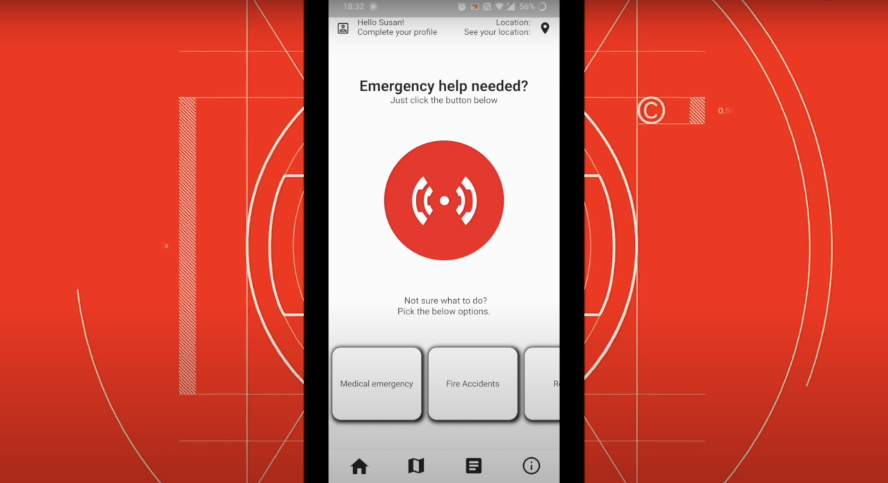
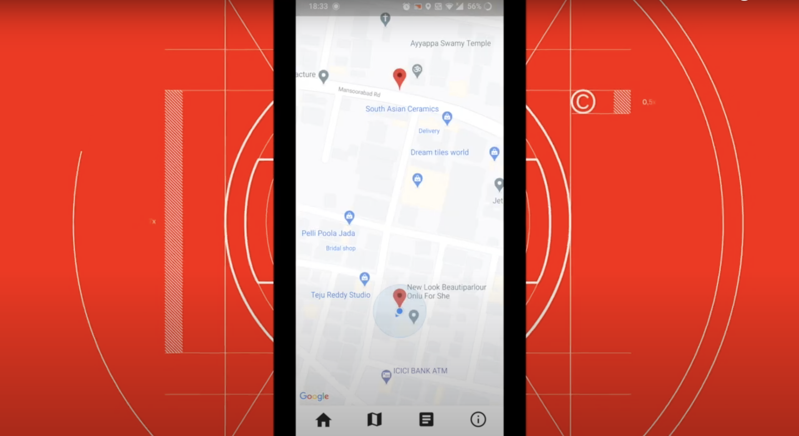
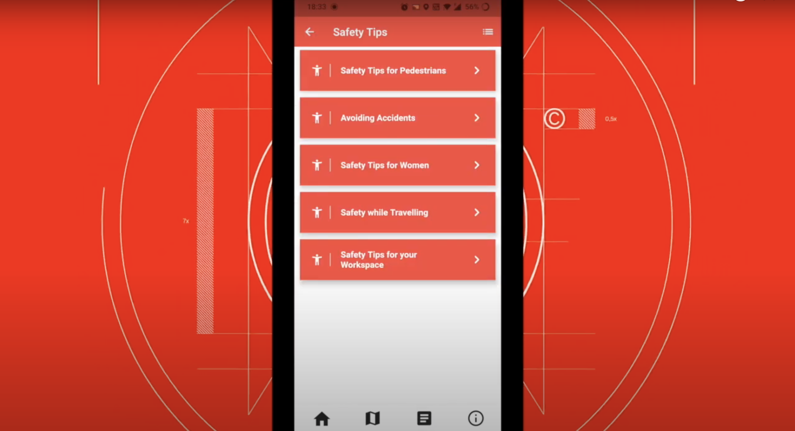
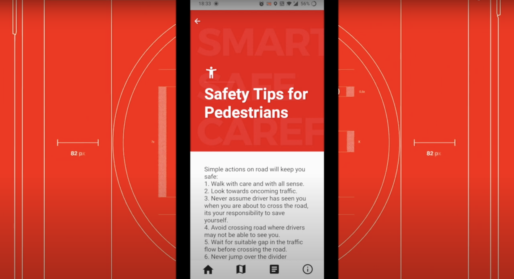
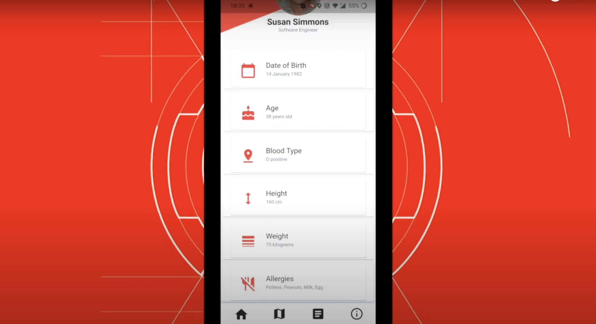

# SOZO
## The Advanced SOS Application

SOZO is an advanced SOS mobile application that simplifies the process of calling for help. With its efficient flow the app aids in saving more lives. 
No matter where you are, when in need, SOZO can also call for help for your near & dear ones.  

- Life - Saving procedures digitized .
- The Auothorities and locals are the first one to save lifes .

> A BBC investigation revealed that
> seriously ill and injured patients wait for more than an hour  
> to access an Ambulance and for any medical assistance. 

## Table of Contents

* [Motive](#motive)
* [Project Video](#project-video)
* [Features](#features)
* [Technologies](#tech)
* [Development](#development)
* [Vision](#vision)
* [App Preview](#sozo-app)
  * [Home Screen](#home-screen)
  * [Map Interface](#map-interface)
  * [Articles](#articles)
  * [Profile](#user-profile)

## Motive
- Our Team spotted an opportunity to create an app that simplifies the process for calling for help in any critical situations.
- The shock from an accident might prevent the person from calling for help in a timely manner. In emergency situations, witnesses who were not hurt could make an SOS call and alert the locals and authorities.

### Project Video 

A walkthrough of this project is available :[here](https://youtu.be/LTRf5_ohiBI)

## Features

SOZO mainly focuses on :
- The people will be the first responders.
- The Auothorities and locals are the first one to save lifes .
- Access location and save people.
- Many Articles to educate people about safety & health. 

## Tech

SOZO uses Google Tecnologies :

- [Flutter](https://flutter.dev/docs) - Google’s UI toolkit for building beautiful, natively compiled applications for mobile, web, and desktop from a single codebase.
- [Firebase](https://firebase.google.com/docs) -  Google's mobile platform that helps you quickly develop high-quality apps
- [Android](https://codelabs.developers.google.com/?authuser=1) - Mobile Operating System 

## Development

Our inspiration for selecting these specific goals was to make people feel in control of their situation and that they are not alone. 
Be it any kind of help that is needed by the person, a medical emergency, an accident, a vehicle breakdown, a disaster, or any crime incident, help is always on the way. 
We felt like so many crimes and emergencies can be resolved easily if only the person could ask for help and with this application, they finally have a voice. 
You can even help a person near you with the help of this application which alerts all the users and authorities near the person in need for the kind of help needed and volunteers can accept the request for help hence achieving partnership for the goals.

## Vision

Our vision is to connect the people stuck in any sort of difficult situations with those who are ready to extend their help. The app serves to bridge and connect the needy with a volunteer in a most efficient way and on a real time basis.

# SOZO App

## Home Screen
 <kbd></kbd>
 
## Map Interface
 <kbd></kbd>
 
## Articles
 <kbd></kbd>
 <kbd></kbd>
 
## User Profile
 <kbd></kbd>

